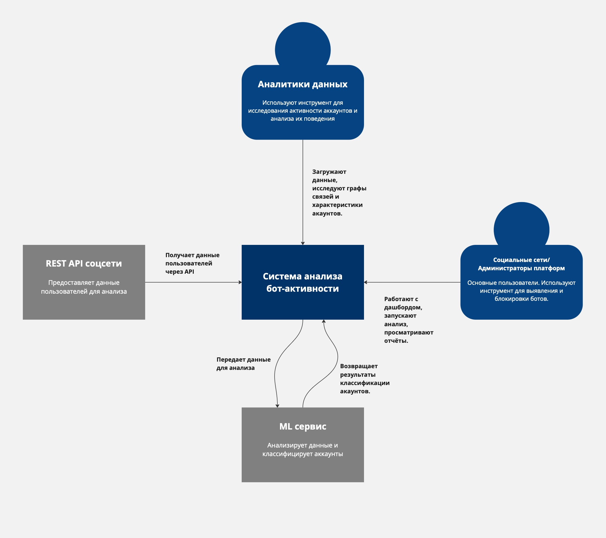
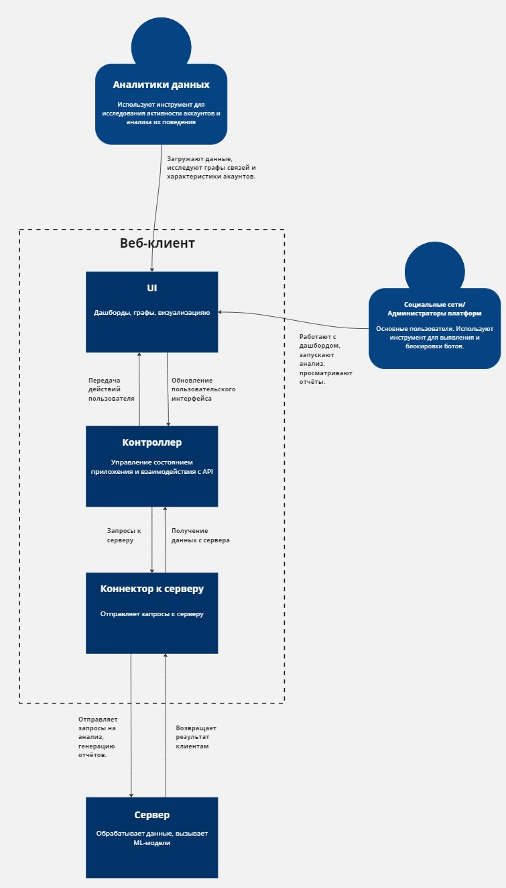

# Разработка программного решения для анализа и выявления бот-активности в социальных сетях

---

## Диаграммы

### 1. Диаграмма системного контекста

### 2. Диаграмма контейнеров
#### Выбор архитектурного стиля

##### Выбранный стиль: Микросервисная архитектура

1. **Масштабируемость**: Микросервисы позволяют масштабировать отдельные компоненты системы, такие как обработка данных или взаимодействие с API социальных сетей. Это особенно важно для обработки большого объема данных в реальном времени или по расписанию.

2. **Изоляция компонентов**: Разделение системы на независимые сервисы снижает сложность, повышает отказоустойчивость и позволяет каждой части системы развиваться и обновляться независимо от других.

3. **Технологическая гибкость**: Микросервисная архитектура позволяет использовать различные технологии для разных компонентов системы, что соответствует выбранным стекам (React.js для фронтенда, Django/FastAPI/Node.js для бэкенда, Python для анализа с использованием машинного обучения). Это позволяет подобрать оптимальный инструмент для каждой задачи.

##### Выбранная архитектура уровня приложений: MVC (Model-View-Controller)

1. **Организация кода**: Архитектура MVC идеально подходит для разделения логики приложения. Модели (Model) будут отвечать за обработку и хранение данных, виды (View) — за отображение информации на дашбордах, а контроллеры (Controller) — за обработку API-запросов и взаимодействие между компонентами.

2. **Масштабируемость**: MVC позволяет легко расширять функциональность системы без нарушения существующей структуры. Например, добавление новых типов отчетов или методов анализа будет несложно интегрировать.

3. **Поддержка многопользовательской работы**: В приложении предусмотрено использование разных типов пользователей (администраторы и аналитики), которые выполняют различные задачи через веб-клиент. MVC позволяет удобно обрабатывать множество запросов и задач одновременно.

4. **Легкость тестирования**: Система будет включать взаимодействие с различными внешними сервисами и анализировать большие объемы данных. MVC позволяет тестировать каждый компонент системы изолированно, что упрощает процесс тестирования и обеспечивает качество кода.

### 3. Диаграмма компонентов
#### Компоненты веб-клиента:

#### Компоненты сервера:

