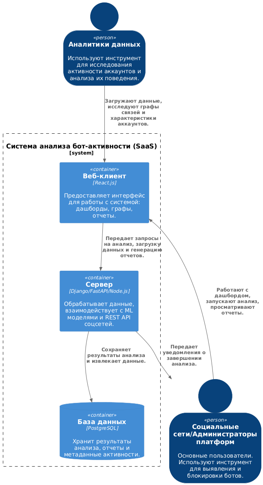
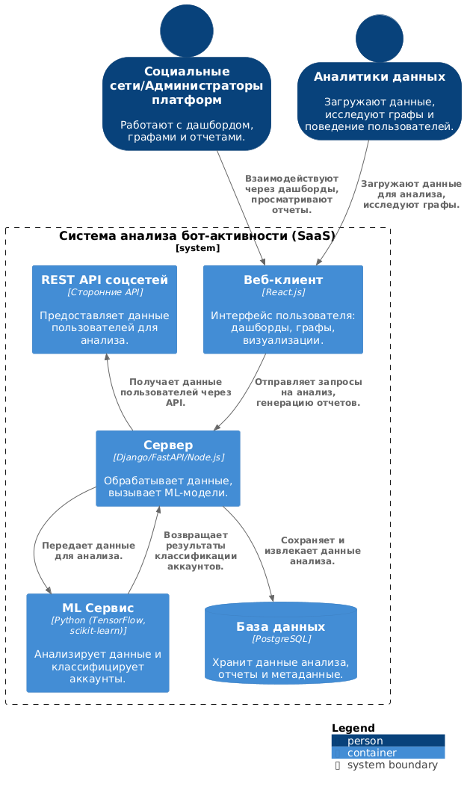
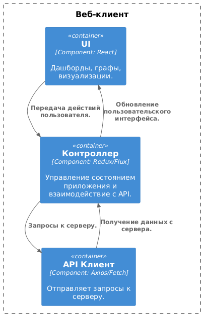
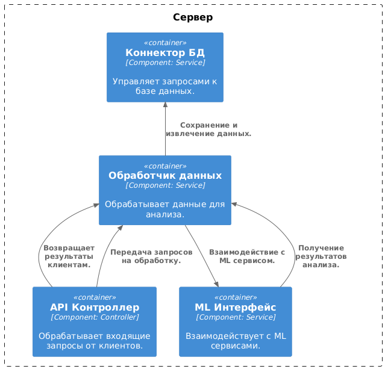

# Разработка программного решения для анализа и выявления бот-активности в социальных сетях

---

## Диаграммы

### 1. Диаграмма системного контекста

### 2. Диаграмма контейнеров

### 3. Диаграмма компонентов
#### Компоненты веб-клиента:

#### Компоненты сервера:

