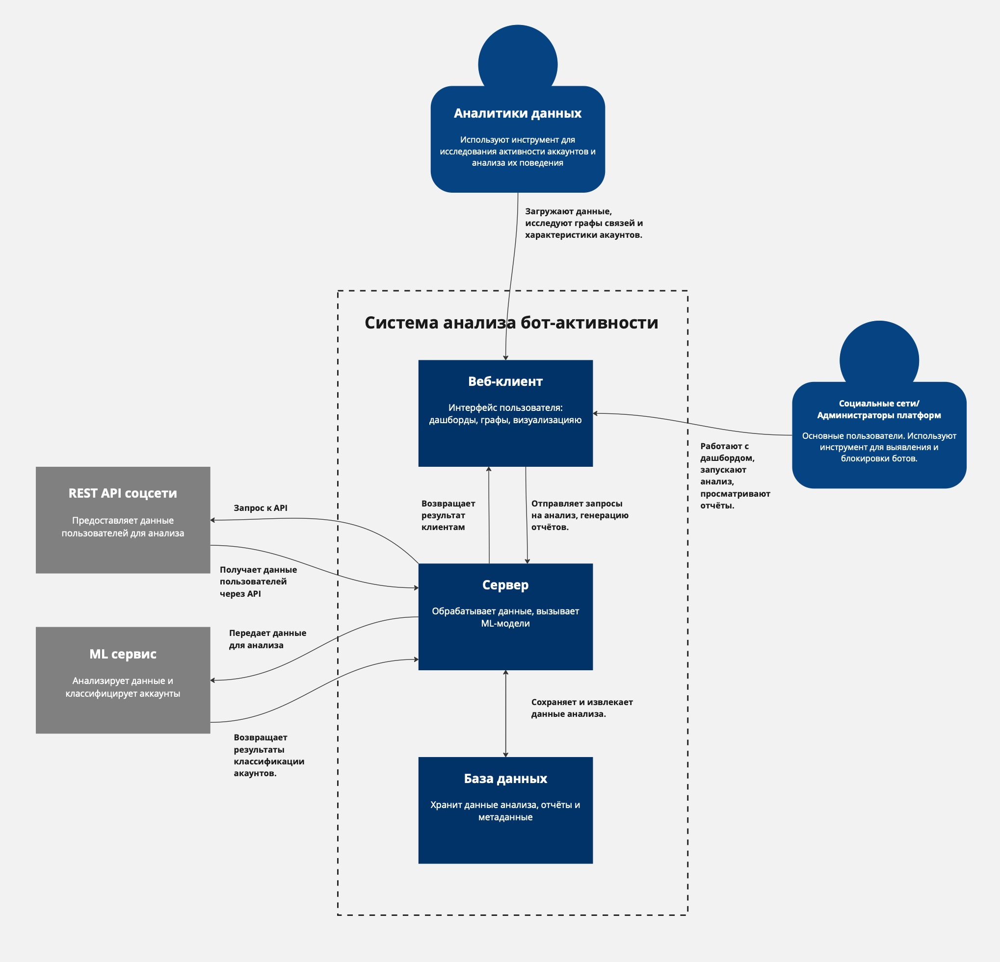
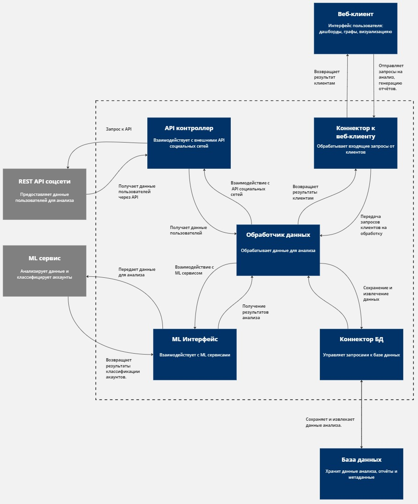
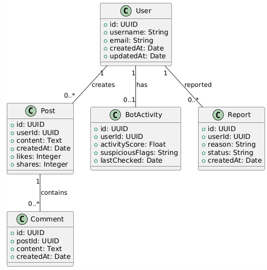

# Разработка программного решения для анализа и выявления бот-активности в социальных сетях

---

## Диаграммы

### Диаграмма контейнеров


### Диаграмма компонентов



### Диаграмма последовательности


### Модель базы данных


User (Пользователь) – основная сущность, представляющая пользователя социальной сети. Содержит информацию о логине, email, времени создания аккаунта, а также связывается с публикациями, бот-активностью и жалобами.

Post (Публикация) – представляет сообщения пользователей в социальной сети. Хранит содержимое поста, количество лайков, репостов и комментариев.

Comment (Комментарий) – отвечает за хранение комментариев к постам. Каждый комментарий привязан к конкретному пользователю и публикации.

BotActivity (Бот-активность) – содержит данные о подозрительной активности пользователя, такие как баллы активности, флаги подозрительного поведения и дату последней проверки.

Report (Жалоба) – фиксирует случаи жалоб на пользователей. Жалоба содержит причину, статус рассмотрения и дату создания.

Взаимосвязи между сущностями:
Один пользователь может создавать множество постов (User → Post).
Один пост может содержать множество комментариев (Post → Comment).
Один пользователь может иметь запись о бот-активности (User → BotActivity).
Один пользователь может быть объектом множества жалоб (User → Report).

### Код с учетом принципов KISS, YAGNI, DRY, и SOLID.

#### Сервер (Flask + SQLite + AI-модель)
```
from flask import Flask, request, jsonify
import sqlite3
import joblib
import re
import datetime
from sklearn.feature_extraction.text import TfidfVectorizer
from sklearn.linear_model import LogisticRegression

app = Flask(__name__)

DB_NAME = "bot_analysis.db"

def init_db():
    with sqlite3.connect(DB_NAME) as conn:
        cursor = conn.cursor()
        cursor.execute('''CREATE TABLE IF NOT EXISTS messages (
                            id INTEGER PRIMARY KEY AUTOINCREMENT,
                            username TEXT,
                            message TEXT,
                            is_bot INTEGER,
                            timestamp TEXT)''')
        conn.commit()

init_db()

try:
    model = joblib.load("bot_model.pkl")
    vectorizer = joblib.load("vectorizer.pkl")
except FileNotFoundError:
    # Если нет модели, создаем пустую
    vectorizer = TfidfVectorizer()
    model = LogisticRegression()

def detect_bot(text):
    """Анализирует сообщение и возвращает 1 (бот) или 0 (человек)"""
    processed_text = preprocess_text(text)
    text_vector = vectorizer.transform([processed_text])
    return int(model.predict(text_vector)[0])

def preprocess_text(text):
    text = text.lower()
    text = re.sub(r"http\S+|www\S+|@\S+", "", text)  # Удаляем ссылки и упоминания
    text = re.sub(r"[^a-zA-Zа-яА-Я0-9\s]", "", text)  # Убираем знаки
    return text.strip()

@app.route('/analyze', methods=['POST'])
def analyze():
    data = request.json
    username = data.get("username")
    message = data.get("message")

    if not username or not message:
        return jsonify({"error": "Необходимо передать username и message"}), 400

    is_bot = detect_bot(message)

    with sqlite3.connect(DB_NAME) as conn:
        cursor = conn.cursor()
        cursor.execute("INSERT INTO messages (username, message, is_bot, timestamp) VALUES (?, ?, ?, ?)",
                       (username, message, is_bot, datetime.datetime.now().isoformat()))
        conn.commit()

    return jsonify({"username": username, "is_bot": bool(is_bot)})

@app.route('/logs', methods=['GET'])
def logs():
    with sqlite3.connect(DB_NAME) as conn:
        cursor = conn.cursor()
        cursor.execute("SELECT * FROM messages ORDER BY timestamp DESC LIMIT 10")
        rows = cursor.fetchall()

    return jsonify([{"id": row[0], "username": row[1], "message": row[2], "is_bot": bool(row[3]), "timestamp": row[4]} for row in rows])

if __name__ == '__main__':
    app.run(debug=True)
```
#### Клиент (Python + requests + PyQt GUI)
```
import sys
import requests
from PyQt5.QtWidgets import QApplication, QWidget, QVBoxLayout, QPushButton, QTextEdit, QLabel, QListWidget

SERVER_URL = "http://127.0.0.1:5000"

class BotDetectorClient(QWidget):
    def __init__(self):
        super().__init__()
        self.init_ui()

    def init_ui(self):
        self.setWindowTitle("Анализатор ботов в соцсетях")
        self.setGeometry(100, 100, 500, 400)

        self.layout = QVBoxLayout()

        self.label = QLabel("Введите сообщение:")
        self.layout.addWidget(self.label)

        self.text_input = QTextEdit()
        self.layout.addWidget(self.text_input)

        self.check_button = QPushButton("Анализировать")
        self.check_button.clicked.connect(self.analyze_message)
        self.layout.addWidget(self.check_button)

        self.result_label = QLabel("")
        self.layout.addWidget(self.result_label)

        self.log_list = QListWidget()
        self.layout.addWidget(self.log_list)

        self.refresh_logs()

        self.setLayout(self.layout)

    def analyze_message(self):
        text = self.text_input.toPlainText()
        if not text.strip():
            self.result_label.setText("Введите сообщение!")
            return

        response = requests.post(f"{SERVER_URL}/analyze", json={"username": "User1", "message": text})
        if response.status_code == 200:
            result = response.json()
            self.result_label.setText("Результат: Бот" if result["is_bot"] else "Результат: Человек")
            self.refresh_logs()
        else:
            self.result_label.setText("Ошибка при анализе")

    def refresh_logs(self):
        response = requests.get(f"{SERVER_URL}/logs")
        if response.status_code == 200:
            logs = response.json()
            self.log_list.clear()
            for log in logs:
                status = "БОТ" if log["is_bot"] else "ЧЕЛОВЕК"
                self.log_list.addItem(f"{log['username']} ({log['timestamp']}): {log['message']} [{status}]")

if __name__ == '__main__':
    app = QApplication(sys.argv)
    client = BotDetectorClient()
    client.show()
    sys.exit(app.exec_())
```
* KISS (Keep It Simple, Stupid)
Простая структура с минимальными зависимостями (Flask, SQLite, PyQt, requests).
Простая модель AI (TF-IDF + логистическая регрессия).
* YAGNI (You Ain't Gonna Need It)
Нет сложных ML-алгоритмов или ненужных API-запросов.
Нет избыточных данных в БД.
* DRY (Don't Repeat Yourself)
detect_bot(), preprocess_text() отделены от API-обработчиков.
Код БД оформлен в отдельные функции.
* SOLID
S: у каждого класса и функции одно назначение.
O:легко добавить новую модель бота.
L: можно заменить detect_bot() на другую модель.
I:минимальный API-интерфейс, без ненужных методов.
D:модель бота загружается отдельно, можно заменить её.

### Другие принципы разработки

####1. BDUF (Big Design Up Front) – Масштабное проектирование прежде всего
#####Суть принципа
BDUF предполагает детальную проработку всей архитектуры перед началом разработки, включая все возможные сценарии, даже если они понадобятся не сразу.

#####Применимость к проекту
Проект использует гибкий подход. Вместо полного проектирования заранее, он развивается итеративно (можно менять ML-модель, улучшать API и интерфейс).
В ML-проектах часто экспериментируют с разными моделями, и BDUF может только замедлить процесс.
Используем MVP, а не сразу полную систему.
Вывод: BDUF не подходит, так как мешает гибкости и быстрой адаптации к изменениям.
####2. SoC (Separation of Concerns) – Принцип разделения ответственности
#####Суть принципа
SoC разделяет систему на независимые компоненты, каждый отвечает за свою задачу. Это упрощает поддержку, тестирование и расширение.

#####Применимость к проекту
Сервер и клиент отделены (Flask API и PyQt GUI).
ML-модель отделена от API, её можно легко заменить (поддержка модульности).
База данных хранит только необходимое, а не смешивается с логикой анализа.
Вывод: SoC улучшает читаемость кода, позволяет масштабировать систему и менять компоненты независимо.

####3. MVP (Minimum Viable Product) – Минимально жизнеспособный продукт
#####Суть принципа
MVP – это базовая версия продукта, содержащая ключевой функционал без избыточных деталей. Главная цель – быстро протестировать идею.

#####Применимость к проекту
Мы реализовали только базовый функционал (анализ сообщений, логирование, базовая ML-модель).
Можно быстро тестировать и получать обратную связь от пользователей.
В будущем можно добавить более сложные ML-модели или дополнительные метрики ботов.
Вывод: MVP идеально подходит, так как позволяет быстро вывести рабочий прототип и улучшать его по мере необходимости.

####4. PoC (Proof of Concept) – Доказательство концепции
#####Суть принципа
PoC используется для проверки жизнеспособности идеи (а не создания готового продукта).

#####Применимость к проекту
Мы доказали, что ML-алгоритм может находить ботов в соцсетях.
Используется простая модель (TF-IDF + Logistic Regression), которая легко заменяется более сложной.
В дальнейшем PoC может перерасти в полноценный MVP с улучшенной моделью.
Полезен, когда необходимо оценить техническую осуществимость или эффективность конкретной концепции перед тем, как начинать полноценную разработку.
Вывод: На ранних стадиях PoC был полезен для проверки идеи, а затем перешли к MVP. В рамках проекта избыточен, требования хорошо изучены и известны
