# Шаблоны проектирования GoF
## Порождающие шаблоны
### 1. Factory Method
* Общее назначение: Позволяет делегировать создание объектов подклассам, упрощая добавление новых типов без изменения основного кода.
* В проекте: Мы можем создать фабрику, которая будет порождать разные анализаторы ботов — например, анализ по ключевым словам, анализ по активности пользователя, анализ с помощью ML-модели.
* UML-диаграмма:
  

* Код:
```
from abc import ABC, abstractmethod

class BotAnalyzer(ABC):
    @abstractmethod
    def analyze(self, message: str):
        pass

class KeywordAnalyzer(BotAnalyzer):
    def analyze(self, message: str):
        if "bot" in message.lower():
            return "Bot detected via keywords!"
        return " Message is safe."

class MLAnalyzer(BotAnalyzer):
    def analyze(self, message: str):
        print("Running ML model on:", message)
        return "Bot detected via ML!" if len(message) % 2 == 0 else " Message is safe."

class BotAnalyzerFactory(ABC):
    @abstractmethod
    def create_analyzer(self) -> BotAnalyzer:
        pass

class KeywordAnalyzerFactory(BotAnalyzerFactory):
    def create_analyzer(self) -> BotAnalyzer:
        return KeywordAnalyzer()

class MLAnalyzerFactory(BotAnalyzerFactory):
    def create_analyzer(self) -> BotAnalyzer:
        return MLAnalyzer()

keyword_factory = KeywordAnalyzerFactory()
ml_factory = MLAnalyzerFactory()

analyzer1 = keyword_factory.create_analyzer()
analyzer2 = ml_factory.create_analyzer()

print(analyzer1.analyze("Hello, I am a bot!"))  
print(analyzer2.analyze("This is a normal message"))

```
  ### 2. Singleton 
* Общее назначение: Гарантирует, что у класса есть только один экземпляр.
* В проекте: Используем для работы с базой данных, чтобы у нас был только один менеджер соединений.
* UML-диаграмма:
  
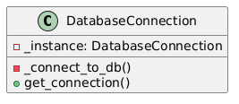
* Код:
```
import psycopg2

class DatabaseConnection:
    _instance = None  # Статическая переменная для хранения единственного экземпляра

    def __new__(cls):
        if cls._instance is None:
            cls._instance = super(DatabaseConnection, cls).__new__(cls)
            cls._instance.connection = cls._connect_to_db()
        return cls._instance

    @staticmethod
    def _connect_to_db():
        return psycopg2.connect(
            dbname="bot_analysis",
            user="admin",
            password="password",
            host="localhost"
        )

    def get_connection(self):
        return self.connection

# Использование:
db1 = DatabaseConnection()
db2 = DatabaseConnection()

print(db1 is db2)  # True — один и тот же экземпляр


```
### 3. Builder 
* Общее назначение: Упрощает создание сложных объектов по шагам.
* В проекте: Используем для конфигурации ML-модели с разными параметрами.
* UML-диаграмма:
  
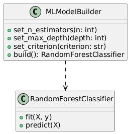
* Код:
```
from sklearn.ensemble import RandomForestClassifier

class MLModelBuilder:
    def __init__(self):
        self.n_estimators = 100
        self.max_depth = None
        self.criterion = "gini"

    def set_n_estimators(self, n):
        self.n_estimators = n
        return self

    def set_max_depth(self, depth):
        self.max_depth = depth
        return self

    def set_criterion(self, criterion):
        self.criterion = criterion
        return self

    def build(self):
        return RandomForestClassifier(n_estimators=self.n_estimators, max_depth=self.max_depth, criterion=self.criterion)

# Использование:
builder = MLModelBuilder()
model = builder.set_n_estimators(200).set_max_depth(10).set_criterion("entropy").build()

print(model)


```
---
## Структурные шаблоны
### 1. Adapter 
* Общее назначение: Позволяет объектам с несовместимыми интерфейсами работать вместе.
* В проекте: Конвертирует API различных соцсетей в единый интерфейс.
* UML-диаграмма:
  
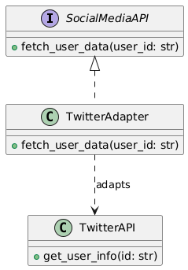
* Код:
```
class TwitterAPI:
    """Старый интерфейс API Twitter"""
    def get_user_info(self, id):
        return {"id": id, "name": "Twitter User", "tweets": 100}

class SocialMediaAPI:
    """Целевой интерфейс"""
    def fetch_user_data(self, user_id):
        raise NotImplementedError

class TwitterAdapter(SocialMediaAPI):
    """Адаптер, приводящий TwitterAPI к общему интерфейсу"""
    def __init__(self, twitter_api):
        self.twitter_api = twitter_api

    def fetch_user_data(self, user_id):
        return self.twitter_api.get_user_info(user_id)

# Использование адаптера
twitter_api = TwitterAPI()
adapter = TwitterAdapter(twitter_api)
print(adapter.fetch_user_data("12345"))


```
  ### 2. Decorator  
* Общее назначение: Динамически расширяет функциональность объектов.
* В проекте:  Добавляет логирование к анализу активности.
* UML-диаграмма:
  
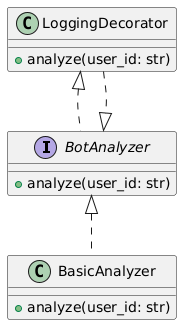
* Код:
```
class BotAnalyzer:
    """Базовый интерфейс анализа ботов"""
    def analyze(self, user_id):
        raise NotImplementedError

class BasicAnalyzer(BotAnalyzer):
    """Базовый анализ без декораторов"""
    def analyze(self, user_id):
        print(f"Analyzing user {user_id}")

class LoggingDecorator(BotAnalyzer):
    """Декоратор для логирования"""
    def __init__(self, analyzer):
        self.analyzer = analyzer

    def analyze(self, user_id):
        print(f"Logging: Starting analysis for {user_id}")
        self.analyzer.analyze(user_id)
        print(f"Logging: Analysis complete for {user_id}")

# Использование
analyzer = LoggingDecorator(BasicAnalyzer())
analyzer.analyze("user123")

```
### 3. Facade  
* Общее назначение: Предоставляет простой интерфейс к сложной системе.
* В проекте: Объединяет работу с API соцсетей и базой данных.
* UML-диаграмма:
  
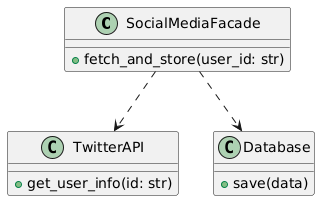
* Код:
```
class TwitterAPI:
    """Работа с Twitter API"""
    def get_user_info(self, id):
        return {"id": id, "name": "Twitter User", "tweets": 100}

class Database:
    """Работа с базой данных"""
    def save(self, data):
        print(f"Saving data: {data}")

class SocialMediaFacade:
    """Фасад, объединяющий API и базу"""
    def __init__(self):
        self.twitter = TwitterAPI()
        self.db = Database()

    def fetch_and_store(self, user_id):
        data = self.twitter.get_user_info(user_id)
        self.db.save(data)

# Использование
facade = SocialMediaFacade()
facade.fetch_and_store("12345")
```
  ### 4. Proxy   
* Общее назначение: Управляет доступом к объекту, добавляя контроль.
* В проекте:  Ограничивает число запросов к API.
* UML-диаграмма:
  
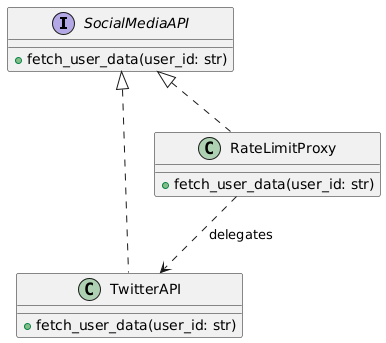
* Код:
```
import time

class TwitterAPI:
    """Работа с Twitter API"""
    def fetch_user_data(self, user_id):
        return {"id": user_id, "name": "Twitter User"}

class RateLimitProxy:
    """Прокси для ограничения частоты запросов"""
    def __init__(self, real_api):
        self.real_api = real_api
        self.last_call = 0

    def fetch_user_data(self, user_id):
        if time.time() - self.last_call < 2:
            print("Rate limit exceeded! Try again later.")
            return None
        self.last_call = time.time()
        return self.real_api.fetch_user_data(user_id)

# Использование
api = RateLimitProxy(TwitterAPI())
print(api.fetch_user_data("12345"))  # Успешный вызов
time.sleep(1)
print(api.fetch_user_data("12345"))  # Ограничение
```
---
## Поведенческие шаблоны
### 1. Observer  
* Общее назначение: Реализует механизм подписки, позволяя объектам уведомлять подписчиков об изменениях.
* В проекте: Следит за изменениями в активности пользователей.
* UML-диаграмма:
  
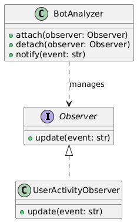
* Код:
```
from typing import List

class Observer:
    def update(self, event: str):
        pass

class BotDetector:
    def __init__(self):
        self._observers: List[Observer] = []

    def attach(self, observer: Observer):
        self._observers.append(observer)

    def detach(self, observer: Observer):
        self._observers.remove(observer)

    def notify(self, event: str):
        for observer in self._observers:
            observer.update(event)

    def detect_bot_activity(self, message: str):
        if "bot" in message.lower():
            print("Bot activity detected!")
            self.notify(f"Suspicious message: {message}")

class Logger(Observer):
    def update(self, event: str):
        print(f"[Logger] {event}")

class AlertSystem(Observer):
    def update(self, event: str):
        print(f"[ALERT] Sending alert: {event}")

detector = BotDetector()
logger = Logger()
alert_system = AlertSystem()

detector.attach(logger)
detector.attach(alert_system)
detector.detect_bot_activity("Hello, I am a friendly bot!")

```
  ### 2. Strategy  
* Общее назначение: Позволяет динамически изменять алгоритм, не меняя сам объект.
* В проекте:  Используется для разных алгоритмов анализа ботов.
* UML-диаграмма:
  
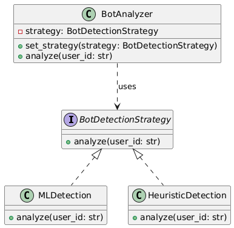
* Код:
```
class BotDetectionStrategy:
    """Интерфейс стратегии"""
    def analyze(self, user_id):
        pass

class MLDetection(BotDetectionStrategy):
    """Анализ с помощью ML-модели"""
    def analyze(self, user_id):
        print(f"ML: Analyzing {user_id}...")

class HeuristicDetection(BotDetectionStrategy):
    """Анализ с помощью эвристики"""
    def analyze(self, user_id):
        print(f"Heuristic: Analyzing {user_id}...")

class BotAnalyzer:
    """Контекст, использующий стратегию"""
    def __init__(self, strategy: BotDetectionStrategy):
        self.strategy = strategy

    def set_strategy(self, strategy: BotDetectionStrategy):
        self.strategy = strategy

    def analyze(self, user_id):
        self.strategy.analyze(user_id)

# Использование
analyzer = BotAnalyzer(MLDetection())
analyzer.analyze("user123")

analyzer.set_strategy(HeuristicDetection())
analyzer.analyze("user456")
```
### 3. Command 
* Общее назначение: Инкапсулирует запрос как объект, позволяя выполнять команды гибко.
* В проекте: Позволяет откладывать или отменять действия с пользователями.
* UML-диаграмма:
  
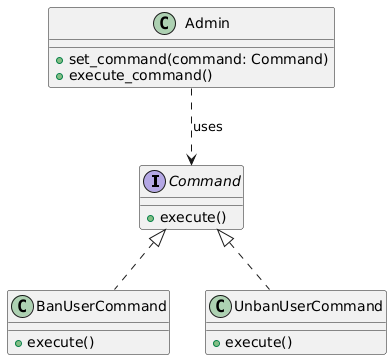
* Код:
```
class Command:
    """Интерфейс команды"""
    def execute(self):
        pass

class BanUserCommand(Command):
    """Команда блокировки пользователя"""
    def __init__(self, user_id):
        self.user_id = user_id

    def execute(self):
        print(f"User {self.user_id} has been banned.")

class UnbanUserCommand(Command):
    """Команда разблокировки пользователя"""
    def __init__(self, user_id):
        self.user_id = user_id

    def execute(self):
        print(f"User {self.user_id} has been unbanned.")

class Admin:
    """Администратор, управляющий командами"""
    def __init__(self):
        self.command = None

    def set_command(self, command):
        self.command = command

    def execute_command(self):
        if self.command:
            self.command.execute()

# Использование
admin = Admin()
admin.set_command(BanUserCommand("user123"))
admin.execute_command()

admin.set_command(UnbanUserCommand("user123"))
admin.execute_command()
```
  ### 4. State    
* Общее назначение: Позволяет объекту менять свое поведение в зависимости от состояния.
* В проекте:  Меняет статус активности пользователя.
* UML-диаграмма:
  
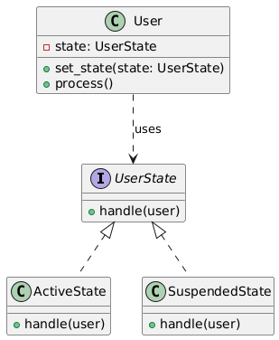
* Код:
```
class UserState:
    """Интерфейс состояния"""
    def handle(self, user):
        pass

class ActiveState(UserState):
    """Состояние активного пользователя"""
    def handle(self, user):
        print(f"User {user.user_id} is active.")

class SuspendedState(UserState):
    """Состояние заблокированного пользователя"""
    def handle(self, user):
        print(f"User {user.user_id} is suspended.")

class User:
    """Класс пользователя с изменяемым состоянием"""
    def __init__(self, user_id):
        self.user_id = user_id
        self.state = ActiveState()

    def set_state(self, state):
        self.state = state

    def process(self):
        self.state.handle(self)

# Использование
user = User("user123")
user.process()

user.set_state(SuspendedState())
user.process()
```
### 5. Chain of Responsibility 
* Общее назначение: Позволяет передавать запрос по цепочке обработчиков.
* В проекте: Позволяет передавать сообщения об активности через цепочку обработчиков.
* UML-диаграмма:
  
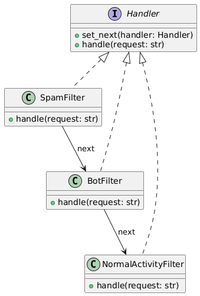
* Код:
```
class Handler:
    def __init__(self):
        self.next_handler = None

    def set_next(self, handler):
        self.next_handler = handler
        return handler

    def handle(self, request):
        if self.next_handler:
            return self.next_handler.handle(request)
        return None

class SpamFilter(Handler):
    def handle(self, request):
        if "spam" in request.lower():
            print("Spam detected! Request blocked.")
            return True 
        print("No spam detected, passing to next filter...")
        return super().handle(request)

class BotFilter(Handler):
    def handle(self, request):
        if "bot" in request.lower():
            print("Bot detected! Request flagged.")
            return True
        print("No bot detected, passing to next filter...")
        return super().handle(request)

class NormalActivityFilter(Handler):
    def handle(self, request):
        print("Request is normal, no issues detected.")
        return True  

spam_filter = SpamFilter()
bot_filter = BotFilter()
normal_filter = NormalActivityFilter()

spam_filter.set_next(bot_filter).set_next(normal_filter)

print("\nТест 1: Сообщение со спамом")
spam_filter.handle("Buy now! Limited offer! Spam content.")

print("\nТест 2: Сообщение с ботом")
spam_filter.handle("Hello, I am a bot. Please verify me.")

print("\nТест 3: Обычное сообщение")
spam_filter.handle("Hey, how are you?")
```


# Шаблоны проектирования GRASP
## Роли (обязанности) классов

## Принципы разработки

## Свойство программы (цель)
