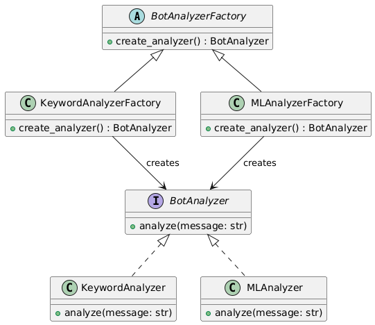

# Шаблоны проектирования GoF
## Порождающие шаблоны
### 1. Factory Method
* Общее назначение: Позволяет создавать объекты без указания их конкретного класса, а через общий интерфейс.
* В проекте: Будем использовать для создания разных анализаторов ботов (например, для Twitter, Telegram, VK).
* UML-диаграмма:
  
* Код:
  
---
## Структурные шаблоны
---
## Поведенческие шаблоны

# Шаблоны проектирования GRASP
## Роли (обязанности) классов

## Принципы разработки

## Свойство программы (цель)
